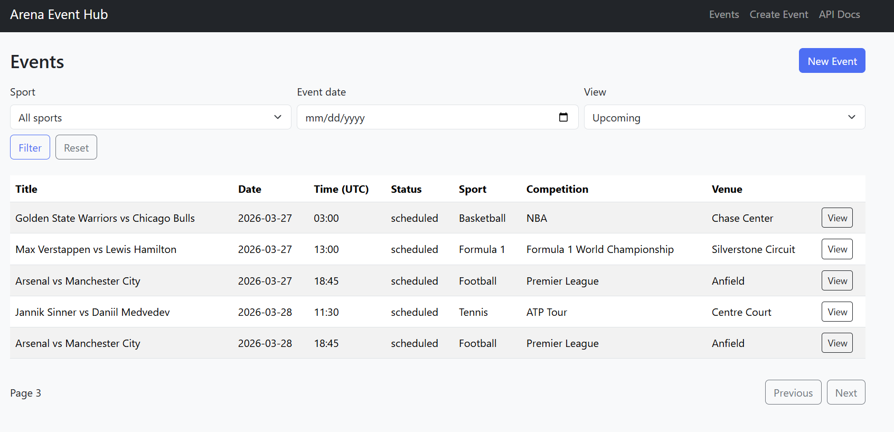
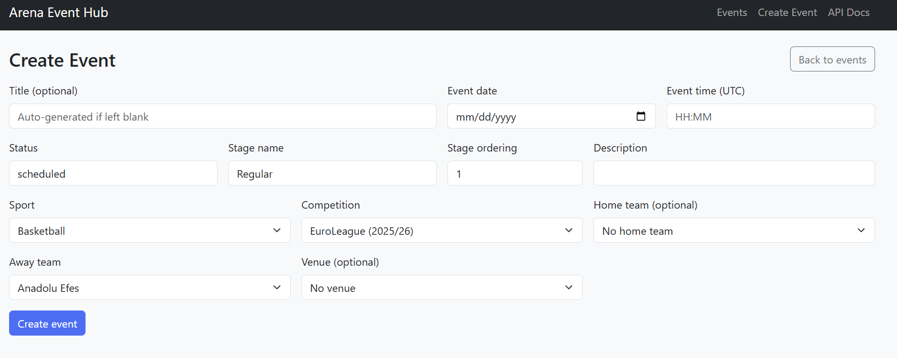
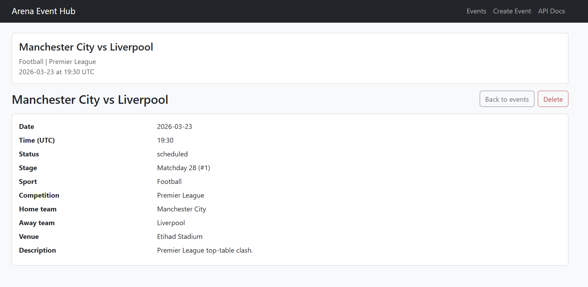
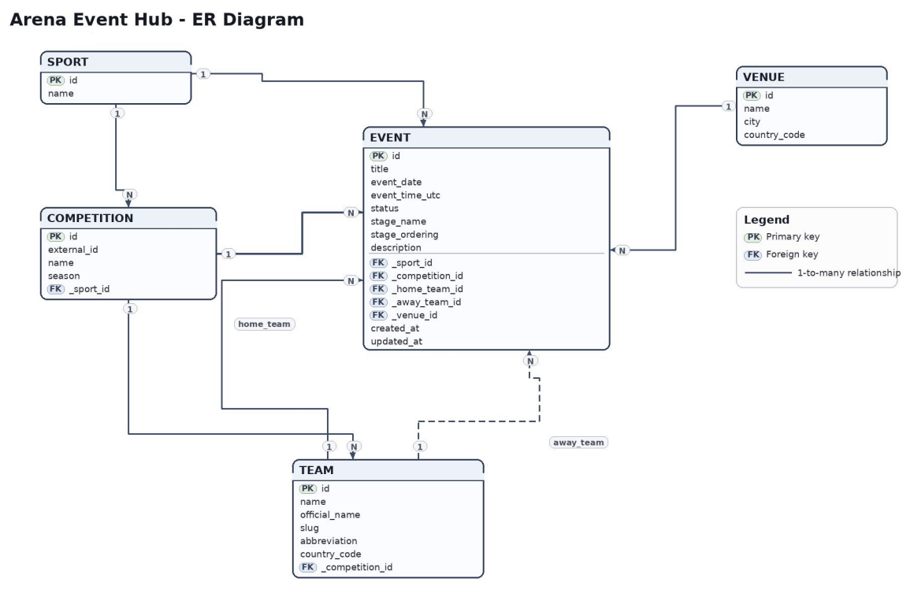

# Arena Event Hub

A clean, backend-focused sports event calendar application built for the Sportradar Backend Challenge.

---

## 🚀 Application Preview

### Events Page


### Create Event


### Event Detail


### ER Diagram

---

## 🧠 Project Overview

Arena Event Hub is a backend-first application designed to manage sports events with a strong focus on:

- clean architecture
- normalized relational data modeling
- validation and business rules
- filtering and pagination
- maintainability and scalability

---

## ⚙️ Tech Stack

- Python 3.12
- FastAPI
- SQLAlchemy 2.0
- SQLite
- Pydantic
- Jinja2 + Bootstrap 5
- pytest
- uvicorn

---

## 🏗️ Architecture

The application follows a layered architecture:

- routers → handle HTTP requests
- services → contain business logic
- repositories → handle database access
- models → define database schema
- schemas → validation and serialization

This separation ensures clarity, testability, and scalability.

---

## 🗂️ Data Model

Entities:

- Sport
- Competition
- Team
- Venue
- Event

Key design decisions:

- Event is the central entity
- normalized relationships (no duplication)
- teams are reused across events
- competitions group teams logically
- optional relationships supported (venue, home team)

---

## 📏 Business Rules & Validation

- event date cannot be in the past
- home team cannot equal away team
- teams must belong to selected competition
- missing title is auto-generated
- filtering handles empty inputs safely

---

## 🔍 Features

- create, list, view, delete events
- filtering by sport and date
- upcoming / past / all mode
- pagination
- realistic seeded data
- dynamic dropdown relationships
- validation layer for consistency

---

## ▶️ Run Locally

```bash
python -m venv .venv
.venv\Scripts\activate
pip install -r requirements.txt
uvicorn app.main:app --reload

Open:
http://127.0.0.1:8000/events

🧪 Run Tests
pytest
⚖️ Design Decisions
chose SQLite for simplicity and portability
avoided over-engineering (no unnecessary microservices)
prioritized clarity over abstraction
kept backend logic explicit and testable
🔮 Future Improvements
external sports API integration
authentication & user roles
caching layer
async DB optimization
advanced search & sorting
